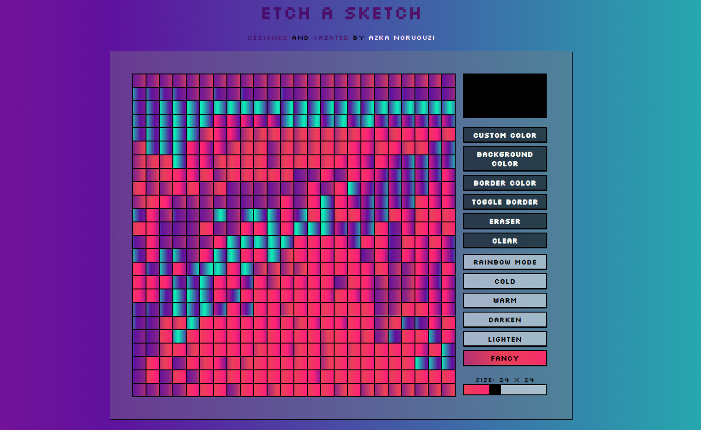

;

## Hello! 👋

Hello world this is me Azka.
Create your very own pixel art with Etch a Sketch.

live preview -> (https://azkanorouzi.github.io/Etch-A-sketch/)[live preview]

## Features.

With etch a sketch you are able to:

- Change pen color.
- Change background color.
- Change border color.
- Toggle border.
- Erase colored areas.
- Clear whole canvas.
- Rainbow mode: generates a random pen color
- Cold: generates a random color from a cold color palette.
- Warm: generates a random color from a warm color palette.
- Darken: darkens colored areas.
- Lighten: Lighten colored areas.
- Change canvas size.
